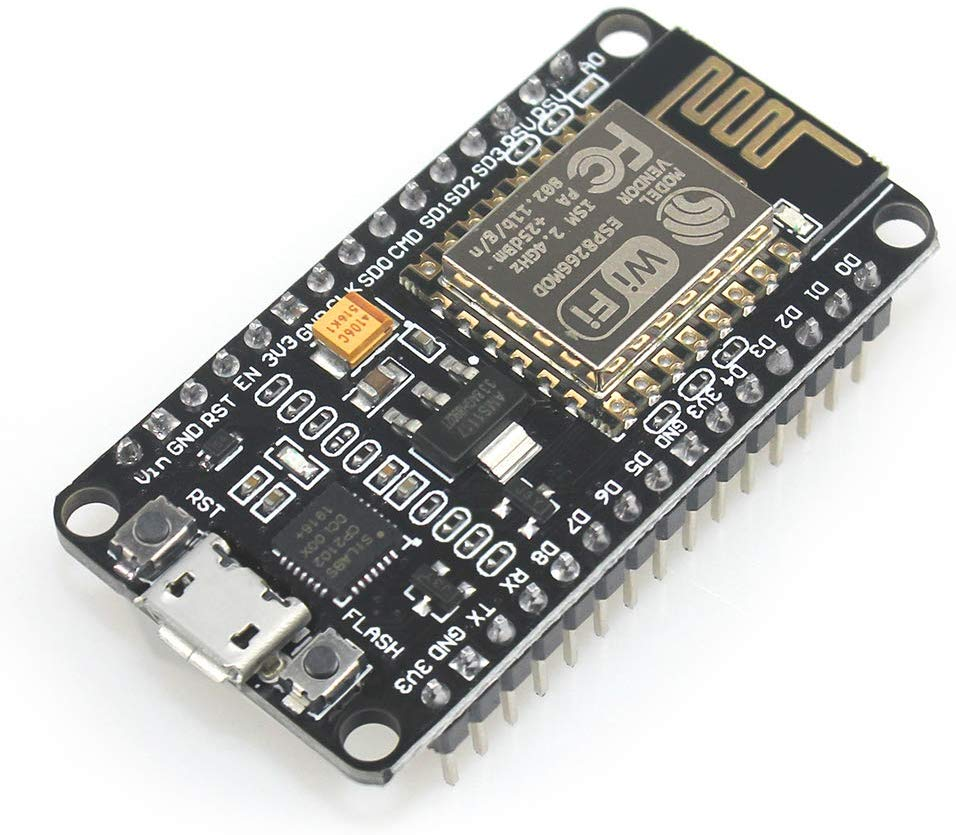
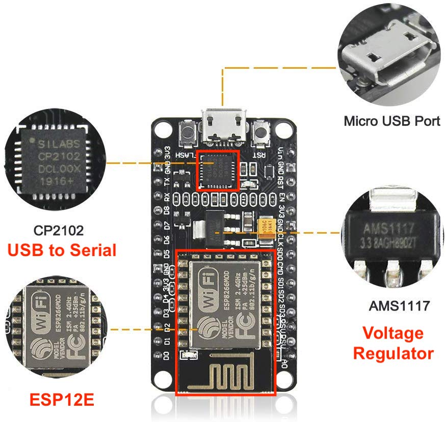
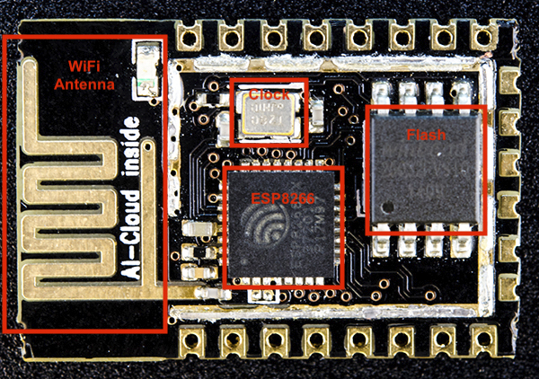
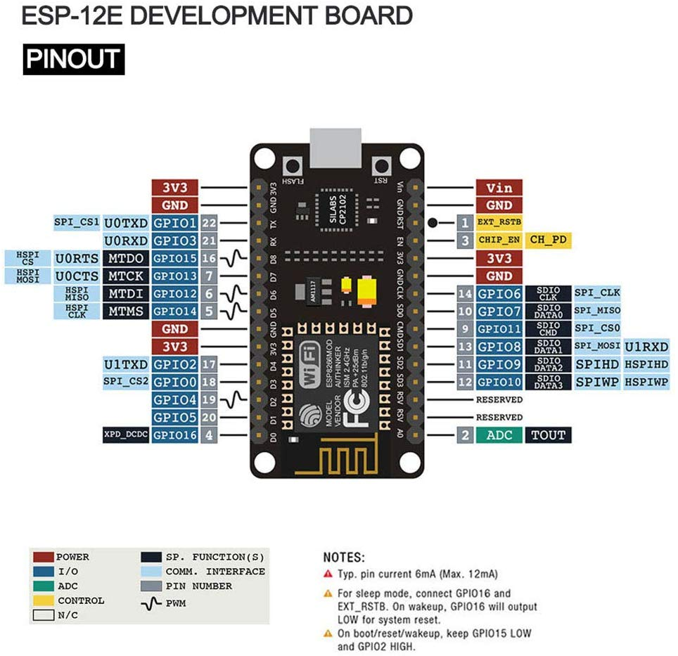

## SJTG IOT Workshop

### Using the NodeMCU v1.0 Board
ESP8266 -> ESP12E -> NodeMCUv1.0

**The Board and Chips:**

This Boards uses the AI Thinker ESP12E to house its ESP8266

# Board/Chip Information

[NodeMCU Wikipedia](https://en.wikipedia.org/wiki/NodeMCU)

[NodeMCU Website](http://www.nodemcu.com/index_en.html)

[NodeMCU Firmware Builder](https://nodemcu-build.com/)

[ESP8266 Chip Communication Software](https://github.com/espressif/esptool)

[ESP8266 core for Arduino](https://github.com/esp8266/Arduino)

[USB Serial Drivers CP2102](https://www.silabs.com/products/development-tools/software/usb-to-uart-bridge-vcp-drivers)

[Learn Arduino Complier](https://www.youtube.com/watch?v=iAVfz2XXj-o)

# ESP12E Pinout

# NodeMCU v1.0 Pinout

# The Language:

[Wiring Programing Language](https://en.wikipedia.org/wiki/Wiring_(development_platform))

[Arduino Programing Language](https://en.wikipedia.org/wiki/Arduino#Software)

Other options like Lua, Micropython ...

[See Platform IO supported Framewoks](https://docs.platformio.org/en/latest/frameworks/index.html#frameworks)

## VS Code and Platform IO

Install PlatformIO Plugin for VSCode

[VSCode + PlatformIO Quickstart](https://docs.platformio.org/en/latest/ide/vscode.html#quick-start)

[PlatformIO espressif8266](https://docs.platformio.org/en/latest/platforms/espressif8266)

[PlatformIO espressif8266 File upload ](https://docs.platformio.org/en/latest/platforms/espressif8266.html#uploading-files-to-file-system-spiffs)

[PlatformIO  nodemcuv2](https://docs.platformio.org/en/latest/boards/espressif8266/nodemcuv2.html)

Recommeded VSCode Plugins
- **Code Spell Checker**
- **Error Gutters**
- **Error Lens**

# Further Links

[Educational Inspiration and Core Source for ESP8266](https://tttapa.github.io/ESP8266/Chap01%20-%20ESP8266.html)

### Web Server / Authentication

[ESP8266 WebServer Docs](https://github.com/esp8266/Arduino/tree/master/libraries/ESP8266WebServer)

[ESP8266 WebServer Examples](github.com/esp8266/Arduino/tree/master/libraries/ESP8266WebServer/examples)

See above for:

HTTPS, etc

Password insecure (ideally use hashing and check server side)

Also http insecure (ran on local network though)

### mDNS

[Docs](https://github.com/esp8266/Arduino/tree/master/libraries/ESP8266mDNS)

### SPIFFS

[Docs](https://github.com/pellepl/spiffs)

[Library to use](https://github.com/bitmario/SPIFFSLogger)

[Example](https://www.esp8266.com/viewtopic.php?f=11&t=13017)

	Note: Our code ignores some best practice like basic code checks. i.e. does the file exist, how large is it.

  
# NTP

[UTC Offset Times](https://en.wikipedia.org/wiki/List_of_UTC_time_offsets)

[NTP Tut](https://lastminuteengineers.com/esp8266-ntp-server-date-time-tutorial/)

[Example](https://www.geekstips.com/arduino-time-sync-ntp-server-esp8266-udp/)

	Note: Our code functions to get current timestamp for PST. Could also build in calander days or roll your own NTP server

# Led Control
[NodeMCU ESP8266 Onboard LED Control](https://lowvoltage.github.io/2017/07/09/Onboard-LEDs-NodeMCU-Got-Two)

# Web Soruce Code

[Source for html5 login](https://hongkiat.github.io/html5-loginpage/)

[Pure css toggle](https://codepen.io/himalayasingh/pen/EdVzNL)

[Other cool swtich](https://codepen.io/khaoula12/pen/BEfyz)

# Misc Links

[Random esp8266 password complexity guide](https://jjssoftware.github.io/esp8266-password-complexify/)

[esp8266-web-server-spiffs-nodemcu tutorial](https://randomnerdtutorials.com/esp8266-web-server-spiffs-nodemcu/)

[nodemcu-pyflasher](https://github.com/marcelstoer/nodemcu-pyflasher)

[esp8266-pinout-reference-gpios](https://randomnerdtutorials.com/esp8266-pinout-reference-gpios/)

[NodeMCU-ESP8266-Details-and-Pinout](https://www.instructables.com/id/NodeMCU-ESP8266-Details-and-Pinout/)
